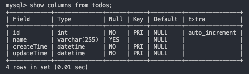

## 操作手順

参考資料 : https://qiita.com/AndanteSysDes/items/a25acc1523fa674e7eda

### docker-compose 起動

1. `dc build`
2. `dc up -d`

### 【※IP 固定したからいらないかも】DB のホストを設定

3. `docker network inspect app_net`
4. db の IP を config.py の host 部分に記入

### migrate する

5. `docker exec -it my_flask_flask_1 bash`
6. コンテナ内で以下の操作を行う
   `flask db init`
   `flask db migrate`
   `flask db upgrade`
7. `exit;`で抜ける

### MySQL コンテナに入って DB 作成できているかの確認

8. `docker exec -it my_flask_db_1 bin/bash`
9. コンテナ内で以下の操作を行う
   `mysql -u misato -ppassword todo`
   `mysql> show tables;`
10. 設定した`todos`テーブルがあるか確認

### 実際にアクセスする

- localhost:5000/
  - ハローワールド
- localhost:5000/show
  - 一覧が見れる
- localhost:5000/add
  - uebo が増える
- localhost:5000/delete
  - uebo が消える

### コンテナ・ボリューム・イメージ全部消す

`docker-compose down --rmi all --volumes --remove-orphans`

### コンテナ立ち上げ前に不必要なフォルダ削除

`/Users/misato/Docker/my_flask/reset.sh`
※ 自宅 PC でのみ使用可能。my_flask フォルダの階層で行う。

### テーブルの column 情報

